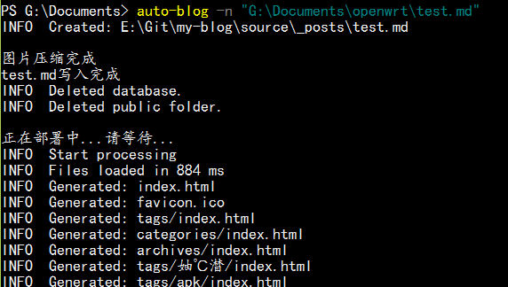

# auto-blog

一个能将本地写的文章自动发布到博客上命令行工具，并且会自动压缩文章里使用的本地图片

## 支持的博客类型

使用 Hexo 搭建的博客

## Install

```bash
$ git clone https://github.com/XiaoGaoYang/auto-blog.git
$ cd auto-blog
$ npm install
$ npm link
```

## Usage

使用前在文章首部添加如下内容
```
---
title: <文章标题>
tags: <文章标签>
categories: <文章分类>
---
```

在命令行里执行下面命令

```bash
# -n 参数为要发布的文章的本地路径
$ auto-blog -n "G:\test.md"
```

## ScreenShots



## TODO

+ [ ] 兼容Linux系统
+ [ ] 发布CSDN博客
+ [ ] 发布工作室wiki
+ [ ] 已发布文章修改